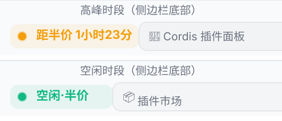
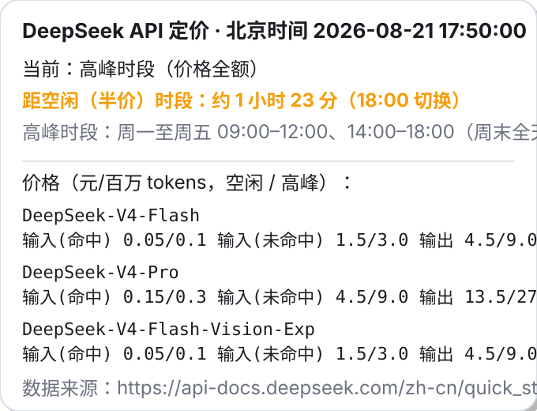

# dsh-deepseek-price — DeepSeek 价格区间计时工具 ⏱️

[](LICENSE)
[](https://github.com/oxgbl/dsh-deepseek-price/releases)
[](https://github.com/oxgbl/dsh-deepseek-price)
[](https://api-docs.deepseek.com/)

> ⏱️ **实时掌握 DeepSeek API 高峰/空闲价格区间**：侧边栏徽标 + 距半价倒计时 + 点击详情面板 + `/price` 命令。

DeepSeek Harness 插件：实时显示 DeepSeek API 模型价格处于**高峰时段**还是**空闲时段**（低峰时段），并倒计时下一个**半价时段**。

- **侧边栏实时徽标**：Web 界面左下角常驻显示 `高峰时段`（琥珀色圆点）或 `空闲时段·半价`（绿色圆点）；高峰时徽标直接显示 **“距半价 X小时Y分”倒计时**，悬停可见完整时段信息与价格表，**点击弹出时段详情面板**（当前时段、距半价倒计时、价格表），每 10 秒自动刷新。
- **`/price` 命令**：在会话中输出当前时段、**距半价时段的时间**、下次切换时间与官方价格表。

依据官方定价文档：[模型 & 价格 | DeepSeek API Docs](https://api-docs.deepseek.com/zh-cn/quick_start/pricing/)

> **高峰时段（北京时间）**：`周一至周五 9:00 - 12:00`、`14:00 - 18:00`
> **空闲时段**：其余时间（含**周末全天**），价格为高峰时段价格的一半。

| 模型（元 / 百万 tokens） | 输入（缓存命中，空闲/高峰） | 输入（缓存未命中，空闲/高峰） | 输出（空闲/高峰） |
| --- | --- | --- | --- |
| `deepseek-v4-flash` | 0.05 / 0.10 | 1.5 / 3.0 | 4.5 / 9.0 |
| `deepseek-v4-pro` | 0.15 / 0.30 | 4.5 / 9.0 | 13.5 / 27.0 |
| `deepseek-v4-flash-vision-exp` | 0.05 / 0.10 | 1.5 / 3.0 | 4.5 / 9.0 |

## 效果预览

> 示意图，实际外观随界面主题（浅色/深色）略有差异。

**侧边栏徽标**（高峰：琥珀色圆点 + "距半价"倒计时；空闲：绿色圆点 + "空闲·半价"）：



**点击徽标弹出的时段详情面板**：



## 结构

```
dsh-deepseek-price/
├── package.json          # dsh.client 声明（platform: web + ./client 导出）
├── lib/
│   ├── index.js          # Host 插件：/price 命令
│   ├── client.js         # Client 插件：侧边栏高峰/空闲徽标（自包含 bundle）
│   └── pricing.js        # 纯逻辑：北京时间峰谷判定 + 价格表
└── README.md
```

## 安装

### 方式零（最简单，推荐）：把仓库地址发给 DSH

把 `https://github.com/oxgbl/dsh-deepseek-price` 复制给你正在使用的 DeepSeek Harness 会话，
说"安装这个插件"即可。DSH 会自动完成：

1. 从 GitHub 获取仓库文件（`gh api` / git clone / 下载 zip 均可）；
2. 解压到 `$env:USERPROFILE\.dsh\profiles\node_modules\dsh-deepseek-price`；
3. 在 profile 的 `cordis.patch.yml`（桌面 `desktop\` / Web `web\`）追加 loader entry；
4. 提示你重启 DSH Desktop（或 web 进程）。

重启后侧边栏底部出现定价徽标（点击可看详情），会话里可用 `/price` 命令。

> 终端用户也可以直接运行仓库里的 `install.ps1`（克隆或解压后执行）：
>
> ```powershell
> powershell -ExecutionPolicy Bypass -File install.ps1 -Profile desktop   # 或 -Profile web
> ```

### 手动安装步骤

> ⚠️ 重要：本插件是 **loader entry（客户端模块）格式**，不是 profile bundle。
> **不要**把它加进 profile 的 `dsh.profile.bundles` 数组——桌面/Web 的启动器
> 要求该数组里的每个包都声明 `dsh.bundle.patch`（像内置的
> `@deepseek-ai/dsh-base` 那样），否则会在启动时直接报错退出：
> `profile bundle "dsh-deepseek-price" declares no dsh.bundle in its package.json`。

### 步骤

1. 把 `dsh-deepseek-price` 放到 profile 可解析的位置（flat fallback）：

   ```powershell
   Copy-Item -Recurse .\dsh-deepseek-price "$env:USERPROFILE\.dsh\profiles\node_modules\dsh-deepseek-price"
   ```

2. 在 profile 的用户补丁文件里追加一条 loader entry（`id` 不能与其它 entry 重复）：

   - 桌面版：`$env:USERPROFILE\.dsh\profiles\desktop\cordis.patch.yml`
   - Web 版：`$env:USERPROFILE\.dsh\profiles\web\cordis.patch.yml`

   ```yaml
   - insert:
       - id: deepseek-price
         name: dsh-deepseek-price
   ```

3. 完全退出并重新打开 DeepSeek Harness Desktop（或重启 web 进程）。

生效后：宿主半注册 `/price` 命令；客户端半被 `dsh-client-modules` 扫进
`window.__DSH_BOOT__` 图，浏览器加载 `/plugins/dsh-deepseek-price/client.js`，
侧边栏底部出现高峰/空闲徽标。

> `dsh plugin add dsh-deepseek-price` 只会把包作为依赖安装（既不会加入
> `dsh.profile.bundles`，也不会触发启动报错），但**不会激活插件**——仍需执行
> 上面的第 2 步。

> 说明：`dsh.profile.bundles` 与 `cordis.patch.yml` 是两种不同机制——bundle 要求
> `dsh.bundle.patch` 声明并贡献整层补丁；loader entry 则是把包当作一个 Cordis
> 插件行挂进组合。本插件属于后者。客户端插件清单（`window.__DSH_BOOT__`）在
> 启动时扫描 loader entries，新增插件需要**重启桌面应用**才会生效；已有插件的
> bundle 内容变更可借助 `pnpm run dev:web` 的 HMR 链热更新。

## 卸载

- 从对应 profile 的 `cordis.patch.yml` 删除 `deepseek-price` 的 `insert` 条目（桌面：`desktop\cordis.patch.yml`；Web：`web\cordis.patch.yml`）；
- 删除 `$env:USERPROFILE\.dsh\profiles\node_modules\dsh-deepseek-price`；
- 重启桌面应用。

## 价格数据时效

价格与时段以官方文档页面为准。DeepSeek 曾于 2026-08-17 启用峰谷分时定价并上调价格，
本插件内置的时段/价格快照来自该页面；官方调整后请同步更新 `lib/pricing.js` 与 `lib/client.js`
中对应的 `PEAK_WINDOWS` / `MODELS` 常量。

## License

MIT
